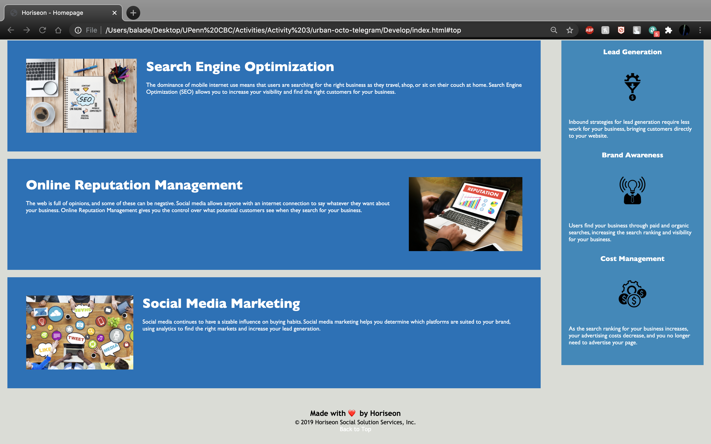

# Code Refactor Starter Code

For my coding bootcamp class, I was tasked with taking some starter code and making some miniscule edits under the hood. So for this webpage I made the website more accessible, removing redundancies, and adding comments for ease of navigation when reading the HTML & CSS files. I hope that my work doesn't go unnoticed.

# About Horiseon

Horiseon is a new kind of marketing agency, that utilizes all the tools of the new world of social media. Horiseon, specializes in the generation of site traffic through the use of search engine optimization. Add their online reputation management, and you have a premier social media marketing firm. With Horiseon, you can watch as your brand awareness and site traffic grows, leading to less need to advertise your page, making them highly affordable.

## Take a Look

[Visit Horiseon](https://baladetohun12.github.io/urban-octo-telegram/)
